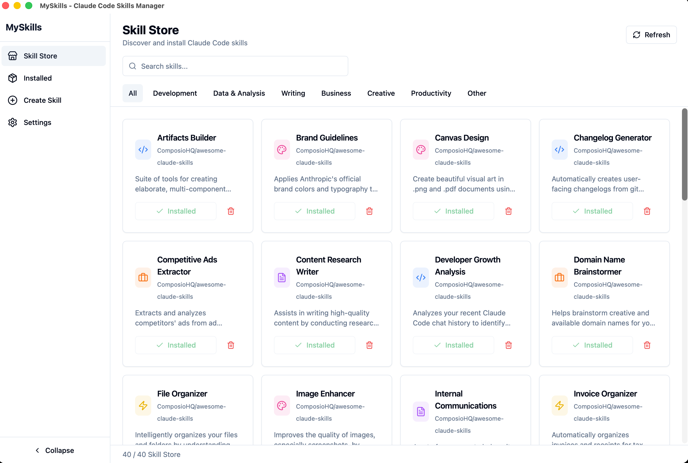
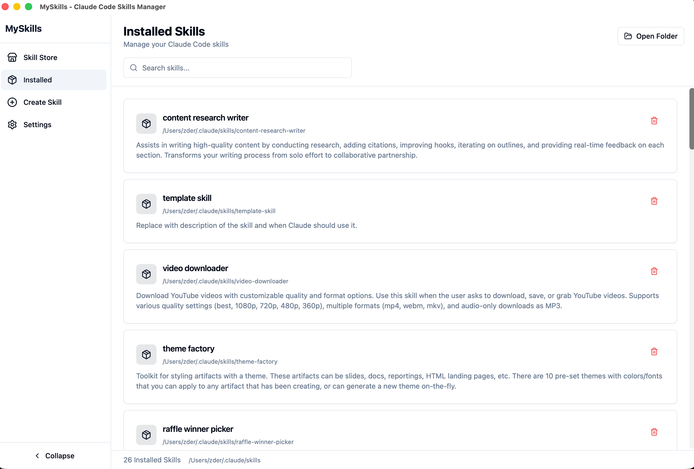
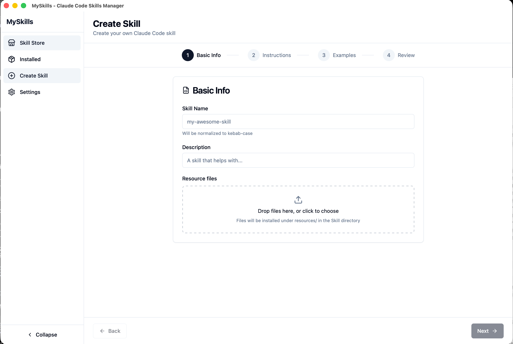

<div align="center">

# MySkills

**Claude Code Skills マネージャー**

[](https://github.com/ImTopz/myskills/actions/workflows/ci.yml)
[](https://github.com/ImTopz/myskills/releases)
[](https://github.com/ImTopz/myskills/stargazers)
[](#システム要件)
[](https://tauri.app/)

[English](README.md) | [中文](README_ZH.md) | 日本語

[Releases](https://github.com/ImTopz/myskills/releases) · [Issues](https://github.com/ImTopz/myskills/issues) · [Actions](https://github.com/ImTopz/myskills/actions)

</div>

MySkills は **Claude Code Skills** を検索・インストール・管理・作成するための軽量デスクトップアプリです。

Skills は `~/.claude/skills/` にインストールされ、GitHub ベースのリポジトリをスキャンして一覧表示、インストール/アンインストール、内容確認、カスタム Skill 作成まで一通り行えます。

## 機能

- **Skill Store**：GitHub リポジトリをスキャンし、`SKILL.md` のメタデータを読み取る
- **完全インストール**：`resources/`、`scripts/` などを含む Skill ディレクトリ全体をインストール
- **Installed 管理**：`SKILL.md` の表示、Finder で開く、アンインストール
- **Skill 作成**：ウィザード形式でカスタム Skill を作成（任意でリソースファイルを追加。`resources/` 配下に配置）
- **リポジトリ管理**：`owner/repo`、GitHub `tree/blob/raw` URL（任意で `ref` とサブパス）に対応
- **UX**：言語の自動判定（中/英）＋手動切替、ライト/ダークテーマ

## スクリーンショット

| ストア | インストール済み | 作成 |
| --- | --- | --- |
|  |  |  |

## ダウンロード & インストール

### システム要件

- **macOS**：10.15+（Apple Silicon）
- **Claude Code**：標準の skills ディレクトリ `~/.claude/skills/` を使用

### macOS（Apple Silicon）

1. [Releases](https://github.com/ImTopz/myskills/releases) から最新の `.dmg` をダウンロード
2. DMG を開き、`MySkills.app` を `Applications` にドラッグ
3. 初回起動時に Gatekeeper にブロックされる場合（未公証）：
   - **System Settings → Privacy & Security → Open Anyway**

## 使い方（Quick Start）

- **Store**：更新 → インストール/アンインストール → 詳細（GitHub へ移動）
- **Installed**：カードを開いて内容確認 → アンインストール / Finder で開く
- **Create**：名前/説明/指示を入力 →（任意）リソース追加 → 作成
- **Settings**：リポジトリ管理、skills ディレクトリ、テーマ/言語

## データの場所

- Skills：`~/.claude/skills/`
- 設定：`~/.myskills/config.json`
- キャッシュ：`~/.myskills/cache/`（カスタムリポジトリのスキャン結果）

## ソースからビルド

### 前提

- Node.js 18+
- Rust stable（`rustup` 推奨）
- Tauri の依存関係：https://tauri.app/start/prerequisites/

### 開発

```bash
npm ci
npm run tauri dev
```

### ビルド（DMG, Apple Silicon）

```bash
npm ci
npm run tauri build -- --target aarch64-apple-darwin --bundles dmg
```

成果物は `src-tauri/target/release/bundle/` に生成されます。

## Star History

[](https://www.star-history.com/#ImTopz/myskills&Date)
